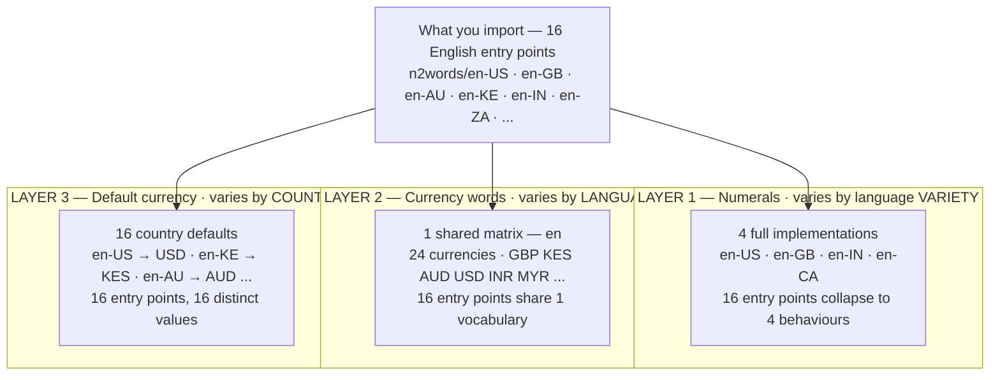

# Language layers

A BCP 47 code like `en-KE` used to encode three independent facts at once:
which numeral grammar to use, which currencies are nameable, and which
currency is the default. Measuring the actual English variants showed those
facts don't vary together — 16 files produced only **3** distinct numeral
outputs under default options, with the other 13 differing solely in which
currency they defaulted to. (Layer 1 ends up with **4** implementations
rather than 3 because `en-CA` exposes an option the others don't — see
[below](#when-a-candidate-turns-out-not-to-be-a-clean-profile).) n2words now
names each fact separately:



| Layer | Varies by | Lives in | Distinct values across English |
| ----- | --------- | -------- | ------------------------------ |
| 1. Numerals | language variety | a full `src/{code}.js` implementation | **4** |
| 2. Currency words | language (or its script/orthography) | `src/utils/currency-vocab.js`, keyed by language | **1** — `en`, 24 currencies |
| 3. Locale profile | country | a thin `src/{code}.js` file with `variantOf` | **16** |

The cardinalities are the argument. Across the same 16 entry points the three
layers have **4**, **1** and **16** distinct values. A single filename can't
encode three facts of three different arities without duplicating something,
and what got duplicated was layer 1 — the numeral logic, which is both the
hard part and the part you least want copied sixteen times.

The practical effect is on layer 2. `en-GB` and `en-KE` each used to hardcode
their own single currency's words, so neither could name the other's; both now
point at one `en` matrix holding both, so `en-GB` renders KES and `en-KE`
renders GBP without either file growing a line:

```text
        WHICH CURRENCIES CAN THIS ENTRY POINT NAME?

  before                             after
        USD GBP KES INR …                  USD GBP KES INR …
  en-US  ●   ·   ·   ·               en-US  ●   ●   ●   ●
  en-GB  ·   ●   ·   ·               en-GB  ●   ●   ●   ●
  en-KE  ·   ·   ●   ·               en-KE  ●   ●   ●   ●
  en-IN  ·   ·   ·   ●               en-IN  ●   ●   ●   ●
    …                                  …
  16 locales × 1 = 16                16 locales × 24 = 384
```

Layer 1 is untouched by any of it: `en-AU` and `en-KE` borrow `en-GB`'s
numeral grammar unconditionally, so adding a currency or a country never
risks the numeral logic.

Arabic shows layer 2 doing the work with no layer-3 files at all — one entry
point, nine Arab-world currencies, and no `ar-MA` file to write, because the
currency was never a property of the *language*:

```js
import { toCurrency } from 'n2words/ar'
toCurrency('3.003', { currency: 'KWD' })  // 'ثلاثة دنانير وثلاثة فلوس'
toCurrency(42.50,   { currency: 'MAD' })  // 'اثنان وأربعون درهماً وخمسون سنتيماً'
```

> Status: adopted for every language with a behaviourally-identical
> numeral clone (English, Spanish) — see
> [bare-tag-aliases.md](./bare-tag-aliases.md) for which multi-variant
> families this does and doesn't apply to, and
> [currency-vocab.md](./currency-vocab.md) for the matrix layer's own
> contract in full.

## Why layer 3 exists

`en-AU` and `en-SG`'s numeral code differed by zero lines of logic before
this — the entire diff between the two files was doc comments. Before the
matrix was keyed by language (layer 2), that duplication was load-bearing:
each locale's `toCurrency` closed over its own hardcoded currency words, so
there was no way to ask `en-GB` for KES or `en-KE` for GBP even though both
would use identical English words — the two locales just happened to each
know one currency. Layer 2 removes that constraint; layer 3 removes the
duplication it was propping up.

A locale profile is `export *` from its base plus a `toCurrency` wrapper:

```js
// src/en-AU.js
import { resolveOptions } from './utils/resolve-options.js'
import { toCurrency as toCurrencyBase, currencyValues } from './en-GB.js'

export * from './en-GB.js'
export const variantOf = 'en-GB'

export const currencyDefaults = { and: true, currency: 'AUD' }

function toCurrency(value, options) {
  return toCurrencyBase(value, resolveOptions(options, currencyDefaults, currencyValues))
}

export { toCurrency }
```

`toCardinal`/`toOrdinal` inherit unchanged via `export *` — a profile makes
no numeral claims of its own. `currencyDefaults` and `toCurrency` are
declared locally, which legally shadows the star-exported bindings of the
same name (ES modules resolve a local export before a re-export); this is
flagged and suppressed with a comment at each occurrence, not silently
allowed, since the codebase's own gates depend on `import-x/export`
elsewhere.

**A pure `export *` profile would be silently wrong.** Shadowing
`currencyDefaults` alone does nothing: the base's `toCurrency` closes over
the base's *own* module-scope `currencyDefaults`, so `en-AU` would report
`currencyDefaults.currency === 'AUD'` while every call with no options still
returned pounds. That's a well-formed, confident, wrong answer — exactly
the failure class this project refuses to ship silently. The wrapper —
apply the profile's own defaults via `resolveOptions`, *then* call the
base — is what actually threads the override through.
[`variant-profile-contract.test.js`](../test/variant-profile-contract.test.js)
exists specifically to catch a profile that regresses to the pure-`export *`
shape: it asserts `profile.toCurrency(v)` with no options matches
`base.toCurrency(v, { currency: profileDefault })` explicitly, for every
profile in `src/`.

## `variantOf` vs `aliasOf`

Both are thin `export *` files, and both are excluded from the fuzz suites
in `contract.test.js`, `range-contract.test.js`, and
`options-contract.test.js` for the same reason: their behaviour is proven by
reference-identity to something already covered, not by re-running the fuzz
suite against a copy.

| | `aliasOf` (bare-tag) | `variantOf` (locale profile) |
| - | - | - |
| Points from | a bare primary subtag (`en`) | a region-qualified code (`en-AU`) |
| Points to | one variant *within its own family* | any full implementation, same language |
| Overrides anything? | No — pure `export *`, nothing shadowed | Yes — `currencyDefaults`/`toCurrency` |
| Gate | `bare-tag-contract.test.js` | `variant-profile-contract.test.js` |

A bare tag never resolves to a profile — `bare-tag-contract.test.js`
excludes any file with `variantOf` set from being treated as a family's
"canonical" variant, the same way it already excludes `aliasOf` files. A
profile never points at another profile or alias either
(`variant-profile-contract.test.js` checks this directly): the numerals a
profile inherits should be one `export *` away, not a chain to walk.

## When a candidate turns out not to be a clean profile

Two real counterexamples surfaced while collapsing English's clones, worth
knowing before adding a new one:

- **An extra option only some variants expose.** `en-CA` supports
  `hundredPairing` ("fifteen hundred" vs "one thousand five hundred"), which
  no other English variant does. A default-value probe across ~1,300 numbers
  can't see this — with `hundredPairing: false` (the default), `en-CA`'s
  output is byte-identical to `en-GB`'s. But the *option itself* is part of
  the public API, and collapsing `en-CA` into a profile would delete it
  silently. `en-CA` stays a full implementation.
- **An invariable-noun currency the base's generic pluralizer can't
  handle.** `taka` (BDT), `ringgit`/`sen` (MYR), `naira`/`kobo` (NGN), and
  `rand` (ZAR) don't pluralize — a single-element word-form array, not the
  usual `[singular, plural]` pair. A base written as
  `count === 1n ? major[0] : major[1]` reads `major[1]` on any count past 1
  and gets `undefined`. The fix generalizes cleanly —
  `count === 1n || major.length < 2 ? major[0] : major[1]` handles both
  shapes — but it has to be applied in the base a profile delegates to
  (`en-GB`, `en-IN`, and `en-US`/`en-CA` directly, since they don't
  delegate), not worked around per profile.

Both were caught by the same mechanism: a full-tree behavioural diff against
a pre-refactor snapshot (every `toCardinal`/`toOrdinal`/`toCurrency` output
across ~1,300 probe values, per code) run after every structural change, not
just at the end. A diff against defaults alone would have missed the first;
a diff that didn't probe every currency a widened matrix newly makes
reachable would have missed the second.

## Adding a new code under this model

- **New country, existing numerals, existing language matrix key.** Write a
  profile (see the `en-AU` example above). Confirm first that the base
  really is a byte-identical clone under default options *and* that its
  currency-building logic is arity-safe for every currency the shared
  matrix might hand it — not just the new profile's own default.
- **New currency, existing language.** One entry in that language's
  `currency-vocab.js` export. See
  [currency-vocab.md](./currency-vocab.md#adding-a-currency-to-a-language).
  No `src/` file changes at all unless the currency needs a new country
  entry point too (previous bullet).
- **New numeral grammar, or the same grammar but genuinely different
  currency-noun grammar** (a gender-sensitive language whose existing
  hardcoded gender wouldn't extend correctly — see
  [currency-vocab.md](./currency-vocab.md#grammatical-gender)). Write a
  full `src/{code}.js` implementation per the normal
  [Language File Pattern](../CLAUDE.md#language-file-pattern).
